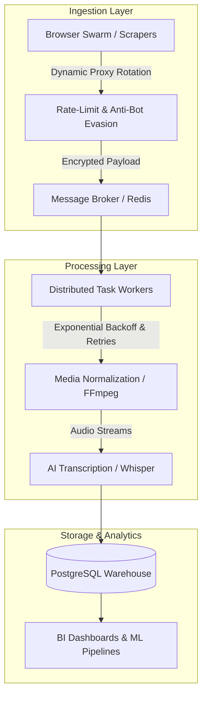

# 🚀 Data Extraction & Automation Engine

<div align="center">
  
  
  
  
</div>

<br>

Enterprise-grade distributed infrastructure designed for high-throughput data extraction, resilient proxy management, anti-bot mitigation, and autonomous AI-driven multimedia ETL pipelines.

---

## 🏗️ Architecture Overview



---

## 🌟 Core Modules

### 1️⃣ Browser Automation Swarm (`src/browser_automation_engine.py`)
* **OS-Level Interaction:** Controls browser instances directly via hardware interrupts and window handles to bypass standard headless bot detection.
* **Concurrency:** Fully asynchronous orchestration using Python `asyncio` and non-blocking mutex locks for active window focus.

### 2️⃣ Resilient Task Worker & Proxy Manager (`src/distributed_task_worker.py`)
* **Proxy Pool Rotation:** Dynamic routing of network-bound requests across residential and datacenter proxies.
* **Fault Tolerance:** Circuit-breaker pattern with jittered exponential backoff and dead-letter queues.

### 3️⃣ Multimedia ETL & AI Transcription Pipeline (`src/video_pipeline_orchestrator.py`)
* **Automated Discovery & Ingestion:** Ingests media data, strips and normalizes audio streams with FFmpeg.
* **NLP & Transcription:** Converts raw audio into structured JSON metadata using AI transcription models (Whisper/Deepgram) and persists to PostgreSQL.

---

## 🛠️ Tech Stack

* **Core:** Python 3.11+, AsyncIO
* **Data Processing & AI:** OpenAI Whisper, FFmpeg, Pandas, BeautifulSoup
* **Infrastructure & Queuing:** Docker, Docker Compose, Redis, PostgreSQL
* **Networking & Resilience:** HTTPX, Requests, Proxy Rotation Gateways

---

## 🚀 Quickstart

### Prerequisites
- Docker & Docker Compose
- Python 3.11+

### 1. Clone & Setup Environment
```bash
git clone https://github.com/coutinhoicaro/data-extraction-automation-engine.git
cd data-extraction-automation-engine
cp .env.example .env
```

### 2. Run with Docker Compose
```bash
docker compose up -d
```

### 3. Run Individual Modules
```bash
pip install -r requirements.txt

# Run Distributed Task Worker
python -m src.distributed_task_worker

# Run Video Pipeline Orchestrator
python -m src.video_pipeline_orchestrator
```

---

## 🛡️ Security & Sanitation Note
This repository contains a sanitized architecture showcase. Proprietary operational configurations, private network endpoints, and production credentials have been abstracted using environment variables and mock providers.

---

## 📄 License
Distributed under the MIT License. See `LICENSE` for details.
