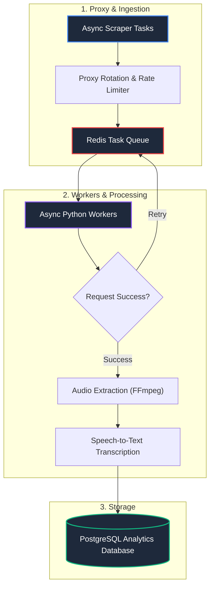

# 🚀 Data Extraction & Automation Engine

<div align="center">

[](https://github.com/coutinhoicaro/data-extraction-automation-engine)
[](https://www.python.org/)
[](https://redis.io/)
[](https://www.postgresql.org/)
[](LICENSE)

<br>

**Distributed Web Scraping & Multimedia Data Extraction Architecture**  
*An asynchronous pipeline designed for high-volume data collection, proxy pool rotation, retry handling, and automated media transcript ingestion.*

</div>

---

## 📌 Overview

Scraping data at scale requires handling rate limits, IP blocks, and slow responses without crashing.

This project implements an **asynchronous distributed extraction architecture**:
* Uses **residential proxy rotation** and exponential backoff to handle rate limits cleanly.
* Queues tasks in **Redis** with worker pools processing jobs concurrently.
* Integrates **FFmpeg** to extract audio from video assets and transcribe them into **PostgreSQL**.

---

## 🏗️ System Architecture



---

## 🌟 Core Modules

1. **Browser & Scraping Automation (`src/browser_automation_engine.py`):** Asynchronous web extraction handling dynamic content and delays.
2. **Distributed Task Worker (`src/distributed_task_worker.py`):** Worker loop managing proxy health and retry backoffs.
3. **Media & Transcript Ingestion (`src/video_pipeline_orchestrator.py`):** Extracts audio tracks and formats text for database storage.

---

## 📂 Repository Structure

```
data-extraction-automation-engine/
├── src/
│   ├── browser_automation_engine.py        # Async Browser & Extraction Logic
│   ├── distributed_task_worker.py          # Redis Worker & Proxy Rotation
│   └── video_pipeline_orchestrator.py      # Media ETL & Transcript Ingestion
├── docker-compose.yml                      # Local Environment Setup Sample
├── requirements.txt                        # Dependencies
├── LICENSE                                 # MIT License
└── README.md                               # Architecture Overview
```

> **Note:** This repository is an **architectural reference implementation**. Production proxy credentials and target scraper configurations are managed in private environments.

---

## 📄 License
Distributed under the **MIT License**. See `LICENSE` for details.
